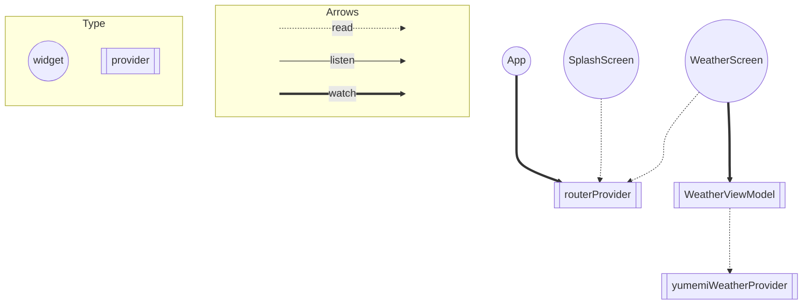

# 状態管理

```mermaid
flowchart TB
  subgraph Arrows
    direction LR
    start1[ ] -..->|read| stop1[ ]
    style start1 height:0px;
    style stop1 height:0px;
    start2[ ] --->|listen| stop2[ ]
    style start2 height:0px;
    style stop2 height:0px;
    start3[ ] ===>|watch| stop3[ ]
    style start3 height:0px;
    style stop3 height:0px;
  end

  subgraph Type
    direction TB
    ConsumerWidget((widget));
    Provider[[provider]];
  end

  App((App));
  App ===> routerProvider;

  weatherViewModel[[WeatherViewModel]];

  WeatherScreen((WeatherScreen));
  WeatherScreen ===>  weatherViewModel;
  routerProvider[[routerProvider]];
  yumemiWeatherProvider[[yumemiWeatherProvider]];
  weatherViewModel -..-> yumemiWeatherProvider;

  SplashScreen((SplashScreen));

  SplashScreen -..->  routerProvider;
  WeatherScreen -..->  routerProvider;

```
